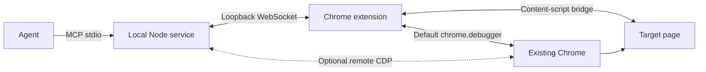

# AntiDebug Breaker MCP

[简体中文](README.md) · [English](README.en.md)

The local MCP service exposes AntiDebug Breaker's built-in script settings, Hook parameters, Vue/React routes, and Agent script library. With browser control enabled, it also provides page interaction, source inspection, network observation, and breakpoint debugging in the Chrome browser you already use.

This is MCP **0.2.0**, paired with extension **3.1.2**. Extension 3.0.8 has no MCP bridge. Use the extension and Agent bundle from the same release. The extension's **Get MCP + Skills** button opens the [matching GitHub Release](https://github.com/0xsdeo/AntiDebug_Breaker/releases/tag/v3.1.2); select `AntiDebug_Breaker-Agent-3.1.2.zip` under **Assets**. Store users keep their store-installed extension.

## Install and pair

The [English installation guide](../docs/agent-install.en.md) covers the complete bundle and skill setup. The service requires **Node.js 22+** and **Chrome 120+**. In this `mcp` directory, run:

```powershell
node --version
npm ci
npm run setup
```

`setup` creates or reuses `.antidebug-breaker/mcp.json` in the current user's home directory and prints its absolute path, connection URL, and pairing token. The default URL is `ws://127.0.0.1:19876/extension`. Existing pairing information is not replaced. For a custom file, use `npm run setup -- --config "C:/Tools/adb-settings/mcp.json"`.

Configure your Agent client to launch a **stdio** MCP service. For clients supporting this format:

```json
{
  "mcpServers": {
    "antidebug-breaker": {
      "command": "node",
      "args": ["C:/Tools/AntiDebug_Breaker-Agent-3.1.2/mcp/src/index.js"]
    }
  }
}
```

Use the actual absolute entry path. If necessary, use an absolute Node executable path for `command`. Windows paths can use `/` in JSON. If setup used a custom file, append `"--config"` and the same file's absolute path to `args`. The outer client configuration format may differ. Restart the service in the client after configuring it.

Only one process can listen on the pairing port. `npm start` can check startup manually, but stop that process before the Agent client starts its own. Normal stdout is reserved for MCP messages; diagnostics use stderr.

In the extension popup, scroll the top navigation to **MCP**, enter the URL and token, and click **Enable MCP and allow browser control**. Once enabled, **Save connection settings** updates pairing information. **Stop MCP** disables the connection and extension browser control, ends extension debugging sessions, and keeps the saved address/token. These enabled or disabled states persist across normal restarts.

The language setting is in the popup's upper-left configuration panel: **Language → Follow browser, 简体中文, or English**. Technical identifiers, user code, and collected data retain their original values. Chrome-owned UI uses the browser language.

## Permissions and transports

The extension declares `debugger` as an installation/update permission. If an update causes Chrome to disable the extension pending permission review, complete that review and re-enable it. The popup's browser-control setting is separate and initially disabled; the Agent cannot enable it itself. Built-in script configuration and route reads do not require browser control, although the MCP bridge must be connected for Agent calls.

For library injection, Chrome 138+ requires **Allow user scripts** in `chrome://extensions/` → AntiDebug Breaker → **Details**; Chrome 120–137 uses **Developer mode**. When this is unavailable, scripts can still be read and saved, but they cannot be registered for automatic injection. After restoring permission, refresh **Scripts** or query the library to retry synchronization, then reload a target to verify its behavior.

### Default extension transport

Call `adb_connect_browser` with `{}` or `{"transport":"extension"}` after enabling MCP and browser control. The service uses the paired loopback WebSocket and `chrome.debugger`. It attaches by the extension's `tabId`, without a remote debugging port, URL guessing, or a first-run page nonce. It does not launch or close the user's browser.

A paused target can be attached and inspected. Operations that need page JavaScript to run may require resume. Chrome still displays its debugging banner. Cancelling that banner disables browser control and releases extension debugging sessions while leaving MCP enabled; use **Re-enable browser control** in the popup before attaching again. Reopening the popup or restarting Chrome does not restore cancelled control automatically.

### Optional remote CDP transport

For the existing-session remote workflow, use Chrome 144+, open `chrome://inspect/#remote-debugging`, enable debugging connections, and call:

```json
{"transport":"remote","channel":"chrome"}
```

Approve Chrome's connection request in the browser. This remote approval is distinct from the extension control setting. The remote transport must connect to the same Chrome/profile as the extension. It verifies a temporary nonce in the page when first binding a tab, so JavaScript must be runnable for that initial binding; resume a paused page first.

Alternatively, provide one of the local `browserURL`, `browserWSEndpoint`, or `userDataDir` options; the last points to a profile location containing `DevToolsActivePort`. At most one endpoint option is allowed. Supported channels are `chrome`, `chrome-beta`, `chrome-dev`, `chrome-canary`, and their `stable`, `beta`, `dev`, `canary` aliases. For compatibility, supplying a channel or remote endpoint without `transport` selects remote, so `{"channel":"chrome"}` is not the default extension connection. Do not mix remote endpoint options with `transport: "extension"`.

## Architecture



| Source | Responsibility |
| --- | --- |
| `background.js`, `extension/policy.js`, `extension/service.js` | Message validation, shared script/configuration rules, revisions, registration, document identity, route caches, and navigation preparation. |
| `extension/user-scripts.js` | Persistent Agent library, its independent revision, and user-script registration/recovery. |
| `extension/bridge.js`, `extension/debugger.js` | Pairing, reconnection, bounded response transport, user control checks, tab creation, and debugger sessions. |
| `content.js`, `scripts/adb_runtime.js` | Page configuration/route bridge, installation acknowledgements, and Hook observations. |
| `mcp/src/index.js`, `mcp/src/config.js`, `mcp/src/bridge.js` | CLI/setup, pairing configuration, stdio lifecycle, and extension request/event transport. |
| `mcp/src/tools.js` | Input validation and all 21 public MCP tools. |
| `mcp/src/browser.js`, `mcp/src/extension-browser.js` | Shared page/network/debugging operations and transport adapters. |
| `mcp/src/cookies.js` | Cookie host/partition selection, deletion, and verification. |
| `tools/package.mjs`, `tools/package-agent.mjs` | Explicit distribution allowlists; available in the complete repository. |

## All 21 tools

Use `adb_list_pages` or a successful `adb_navigate` with `action: "new"` to obtain a `tabId`. A CDP target ID, list index, or URL is not a tab ID. Tool names, parameter keys, error codes, IDs, and machine-readable result fields remain stable across interface languages.

| Tool | Purpose and primary arguments |
| --- | --- |
| `adb_capabilities` | No arguments. Inspect pairing, browser connection, and capabilities, including before pairing completes. |
| `adb_list_pages` | No arguments. List extension tabs and verified browser bindings. |
| `adb_list_scripts` | No arguments. Read built-in script IDs, categories, parent/child relationships, and Hook configuration schemas. |
| `adb_get_state` | `tabId`. Read effective mode, enabled scripts, configuration, revision, and current page application state. |
| `adb_set_scripts` | `tabId`, `scope: hostname/global`, `changes: [{id,enabled}]`; optional `apply`, `expectedRevision`. Explicitly set states rather than toggling; reload requires a browser connection. |
| `adb_script_library` | `action: list/get/save/enable/disable/delete`. Save requires `id`, `name`, `code`, `matches`; optional `enabled`. Other per-script actions require `id`. Writes accept `apply`, `tabId`, `expectedRevision`; reload requires a tab and browser connection. |
| `adb_set_hook_config` | `scriptId`, `patch`; optional `tabId`, `apply`. Use only schema-supported `value`, `param`, `keyword_filter_enabled`, `debugger`, or `stack`. Reload requires a tab and browser connection. |
| `adb_get_routes` | `tabId`; optional `framework: vue/react/all`, `rescan`, `timeoutMs`. Inspect returned status and document identity. |
| `adb_set_mode` | `mode: standard/global`. Select hostname-based or global built-in script settings. |
| `adb_connect_browser` | `{}` defaults to extension; optional `transport: extension/remote` and supported remote channel/endpoint options. |
| `adb_disconnect_browser` | No arguments. End this MCP browser debugging connection; retain Chrome and its tabs. |
| `adb_navigate` | `action: new/navigate/reload/back/forward`. New requires `url`, no `tabId`, optional `active` (default true), and extension transport. Other actions require `tabId`; navigate also requires `url`. Optional `timeoutMs`. |
| `adb_snapshot` | `tabId`; optional `maxElements`, `maxTextLength`. Get a bounded page snapshot and element refs. |
| `adb_interact` | `tabId`, `action: click/type/press/scroll`. Click/type use a ref; type takes text; press takes a key. Supports scroll arguments, `replace`, and document identity checking. |
| `adb_screenshot` | `tabId`; optional `format: png/jpeg/webp`, `quality`, `fullPage`. Returns an MCP image directly. |
| `adb_debug` | `tabId`, `action: attach/status/pause/resume/stepInto/stepOver/stepOut/setBreakpoint/removeBreakpoint/listBreakpoints/variables`. Breakpoints use URL, URL regex, or script ID; locations are one-based. |
| `adb_source` | `tabId`, `action: list/get/search`. Get/search use `scriptId`; supports line ranges, query, regex, case sensitivity, and pagination. |
| `adb_network` | `tabId`, `action: list/get`. Get uses `requestId` and optional `includeBody`; list supports URL substring filtering and pagination. |
| `adb_clear_cookies` | `tabId`. Clear cookies for the current host across paths, including HttpOnly/applicable parent-domain cookies, with host and partition checks. Requires Chrome 138+. Returns verification results and does not reload. |
| `adb_get_events` | Optional `tabId`, `cursor`, `limit`. Read a bounded event cache. Optional `operationId` queries a pending operation and its late result/error separately, including while paused or disconnected. |
| `adb_evaluate` | `tabId`, `expression`; optional `callFrameId`, `returnByValue`, `awaitPromise`, `timeoutMs`. Evaluate in a page or current paused call frame. |

`scripts.prepare` and `pages.create` are internal bridge methods, not additional public tools.

## Workflows

### Create a tab and attach

After `adb_connect_browser` with `{}`, call `adb_navigate`:

```json
{"action":"new","url":"https://example.com/","active":false}
```

This creates a blank tab, attaches observation and the target hostname's early Hooks, then navigates. Use the returned `tabId` for later tools. Existing tabs remain open. Omitting `active` selects the new tab.

`paused` or `timeout` does not mean tab creation failed. Inspect the returned tab instead of creating another. A navigation failure can carry the already-created tab ID in error details; `created: "unknown"` means creation could not be confirmed, so check pages and any late `page.created` event first. Creating a tab requires extension transport; remote can operate existing tabs. `timeoutMs` governs navigation waiting; creation and debugger initialization have separate timeouts.

For an existing tab, call `adb_debug` with `{"tabId":23,"action":"attach"}` before reproducing behavior to initialize observation. Network and console history from before attachment is not reconstructed.

### Configure a Hook and reproduce

First call `adb_capabilities`, `adb_list_pages`, `adb_list_scripts`, and `adb_get_state` for the target. Example `adb_set_scripts` arguments:

```json
{
  "tabId": 23,
  "scope": "hostname",
  "changes": [{"id":"hook_xhr_open","enabled":true}],
  "apply": "next_navigation"
}
```

Then call `adb_set_hook_config`:

```json
{
  "tabId": 23,
  "scriptId": "hook_xhr_open",
  "patch": {
    "keyword_filter_enabled": true,
    "param": ["/api/"],
    "debugger": 0,
    "stack": 1
  },
  "apply": "next_navigation"
}
```

Connect the browser, call `adb_navigate` with `{"tabId":23,"action":"reload"}`, reproduce the request, and inspect events/network results. Saving parameters does not enable the script. If global mode is active, hostname settings are saved as an inactive preset until the mode changes.

Keywords use substring matching. A disabled keyword filter retains the stored keywords but captures all calls. An enabled filter with an empty list also captures all calls. `debugger` and `stack` are 0/1; the service derives its internal `flag`.

### Read Vue/React routes

Enable `Get_Vue_0` or `Get_React_0`, reload, then call `adb_get_routes`:

```json
{"tabId":23,"framework":"all","rescan":true,"timeoutMs":5000}
```

The result distinguishes disabled collectors, timeout, no router, and serialization failure. It covers currently loaded routes recognized by the collector, not every server endpoint or unloaded route. `Get_Vue_1` adds navigation-changing behavior and is not automatically enabled by a route read. Parent/child replacement is handled by the shared policy. Multiple instances remain separate, and data is isolated by tab/document.

### Manage the Agent script library

Check `adb_capabilities.extension.scriptLibrary` first. Library settings and revisions are independent of built-in configuration. Agent writes require the user-enabled browser-control setting; saving for the next navigation does not require an attached debugger. Popup editing and switches can work without MCP.

Example `adb_script_library` save:

```json
{
  "action": "save",
  "id": "example_start",
  "name": "Startup marker example",
  "code": "window.__ADB_LIBRARY_EXAMPLE__ = 'document_start';",
  "matches": ["https://example.com/*"],
  "enabled": true,
  "apply": "next_navigation"
}
```

This example only sets a marker. Update using the same ID and the complete `id`, `name`, `code`, and `matches`. If `enabled` is omitted, new scripts are disabled and existing scripts retain their state. Match rules must identify HTTP(S) hosts, for example `https://example.com/*` or `https://*.example.com/*`; all-site matches are not accepted.

| Operation | Arguments for a separate call |
| --- | --- |
| List | `{"action":"list"}` |
| Read source | `{"action":"get","id":"example_start"}` |
| Enable | `{"action":"enable","id":"example_start"}` |
| Disable | `{"action":"disable","id":"example_start"}` |
| Delete | `{"action":"delete","id":"example_start"}` |

Add `"apply":"reload","tabId":23` to a write when immediate controlled reload is needed, after connecting the browser. `expectedRevision` uses the library revision returned by list/get, not the built-in revision from `adb_get_state`.

Limits include 50 scripts, 2 MiB total library size, 1–20 match rules per script, names of 1–200 characters, and nonempty source up to 131072 characters and 128 KiB UTF-8. Scripts run as ordinary JavaScript at `document_start`, in `MAIN`, in top-level matching pages only. `GM_*`, `@require`, alternate timing, and general Tampermonkey compatibility are not provided. Do not assume a fixed ordering between library scripts and built-in Hooks that wrap the same function.

The **Scripts** tab shows all library scripts and lets users edit names, match rules, and source, toggle scripts, or confirm deletion. Source editing supports Ctrl/Cmd+S and copying. Drafts are kept for the browser session and are not injected. Concurrent changes retain the draft and produce a conflict instead of silently overwriting newer content. Saving does not automatically reload a site.

Scripts and enabled states persist in extension storage; registrations are restored after extension updates when permissions allow. **Disconnecting MCP, closing the Agent, or stopping MCP does not disable enabled library scripts.** Disable/delete to prevent future injection, then reload open pages to remove already-installed effects.

`saved` and `registered` report storage/registration, not execution or task success. `applicationStatus: "unverified"` means there is no page execution acknowledgement; it is not proof that injection failed. Check `status.available`, `status.reason`/`status.guidance`, and each script's `registrationState`. Failed synchronization can leave older registrations active. A write's `registrationUpdated` concerns that script (`registrationScope: "script"`); `status.registrationUpdated` concerns the full library. Reload is skipped if the written script did not synchronize; unrelated registration errors do not prevent its reload. Verify the intended behavior in a new document and provide the script's ID, scope, enabled state, and disable instructions with any delivery.

### Inspect breakpoints and page operations

Use a Hook's `debugger: 1` or `adb_debug setBreakpoint`, reload, and reproduce. If navigation or interaction returns `paused`, call `adb_debug status`; inspect current frames/scopes with `variables`, source with `adb_source`, and locals with `adb_evaluate` using a current `callFrameId`. Resume or step as needed. Refresh frames after each new pause.

Paused-frame evaluation is synchronous: `awaitPromise: true` produces `AWAIT_PROMISE_UNSUPPORTED` without evaluating. Omit it or use false. `timeoutMs` is sent to CDP as the execution timeout; the outer response wait is `timeoutMs + 1500` ms, subject to transport limits. A timeout does not prove side effects were cancelled.

Resume/step responses include `stateChangeObserved`. False means acknowledgement arrived without an observed transition, so returned frames may still be stale; inspect later events/status. True can still mean `paused: true` after a new breakpoint or completed step. `hitBreakpoints` refers to the pause event, not the current breakpoint inventory; removing a breakpoint does not resume execution.

`adb_snapshot` returns refs used by `adb_interact`. Obtain new refs after a new snapshot or navigation. Use its `documentId` for the interaction guard. `adb_screenshot` returns images when needed. DevTools and extension debugging can conflict; inspect detach errors and active debugger state. The remote transport can share target state with DevTools, so manual resume/breakpoint actions affect MCP observations.

### Clear target cookies

After connecting, call `adb_clear_cookies` with an HTTP(S) target, for example `{"tabId":23}`. It uses the debugging channel, including for HttpOnly cookies, and requires confirmed Chrome **138+** for partition isolation.

The scope covers the current host across all paths and applicable parent-domain cookies. It preserves other hosts and other top-level-site partitions; unrecognized partitions are skipped. Cookies are shared across same-domain tabs, and deleting a parent-domain cookie also affects subdomains using it. This tool does not clear the whole browser, erase localStorage, reload the page, or return cookie values.

Results use re-enumeration after deletion. `cleared` means the selected scope was checked, `partial` indicates remaining/skipped in-scope items, and `unverified` means verification could not complete. Review matched, attempted, removed, remaining, and skipped counts. Pages can write cookies again; a completed call is not proof of logout. Inspect pending operations before retrying.

## Scope and application timing

- **Built-in selection:** Standard mode is per hostname, without protocol/port distinction. Global mode uses its global selection. Writing a noncurrent scope does not change the mode.
- **Hook parameters:** Shared globally by script ID, not per tab or hostname. A reload applies to the selected tab, not every affected open page.
- **Library:** Uses its own match rules/revision and persists independently of the MCP connection or Standard/Global mode.
- **Built-in application:** Default `apply` is `next_navigation`. Save, registration, and observed installation are distinct. With reload, `current` is the latest selected-tab state; `applied: true` confirms that page acknowledged the saved revision. `superseded` means a newer revision appeared; `pending_resume` requires continuation; `unconfirmed` requires another state check. Old-page Hooks are not undone by saving settings.
- **Early Hooks:** MCP HTTP(S) navigate/reload installs a target-hostname configuration snapshot and packaged scripts before navigation. Check `earlyHooks`. Coverage is limited to that hostname; cross-host redirects, back/forward, and manual refresh are outside this controlled path. Ordinary navigation uses extension document-start registration and asynchronous configuration. Library injection is separate.
- **Targets:** Primarily top-level documents and same-process execution contexts. OOPIFs and workers are not automatically covered. Restricted Chrome pages and inaccessible targets return errors.

## Data and lifecycle

The local Node service receives tool requests from your chosen Agent client over stdio and communicates with the paired extension over a loopback WebSocket. Tool results can include page content, source code, network data, and captured values, and are returned to that client. The client's own provider and data settings govern its further handling. A local bridge does not mean all Agent processing is local.

The user's pairing file is outside the bundle by default. The extension saves pairing/settings and library scripts in its local storage; it does not inject the pairing token into pages. Events, network records, source indexes, and operation records use bounded runtime caches. They do not reconstruct complete pre-attachment history. Bodies and long results may be missing or truncated; inspect the result flags.

Normal extension bridge frames are limited to 1 MiB by default. CDP responses can be chunked, with a 16 MiB complete JSON response limit. This applies before public-tool truncation: `adb_network` returns at most 1,000,000 body characters with `bodyTruncated`, but an oversized original CDP response can still produce `bodyError`. Other oversized responses return `MESSAGE_TOO_LARGE`; partial JSON is not treated as success.

There are two different document identities:

| Location | Meaning |
| --- | --- |
| `pages[].target.documentId`, `adb_get_state.documentId`, route `target.documentId` | Chrome's native top-level document identity; it may be absent while loading or before reporting. |
| `pages[].binding.documentId`, `adb_snapshot.documentId`, browser-controller event IDs | Reference-cache generation, which can also change because of subframe navigation or execution-context changes. |

Use the snapshot ID for `adb_interact` guards. A changed cache ID alone does not prove a top-level reload. Navigation `loaded` means the corresponding top-level loader completed, while `same_document` and `restored_from_cache` identify other transitions; none proves all asynchronous application work is complete. To investigate repeated reloads, correlate top-level identity, `loaderId`, and `performance.timeOrigin`, distinguishing Agent navigation from page-initiated navigation. A `navigate` transition can still replace the document.

When an operation returns early with `operationPending: true`, it may still execute. If evaluation returned an `operationId`, query `adb_get_events` with that ID. This reads local cached state without re-running the expression or advancing the ordinary event cursor. `pending` means it is still running; `settled` includes an `operation.settled` event whose `data.outcome.value` holds the result/`exceptionDetails`, or whose `data.outcome.error` holds a command error. `data.documentId` identifies the original document; the outer event identity reflects completion-time state.

The separate in-memory cache retains the latest 50 completion events for early-returned operations, and does not survive service exit. `unavailable` means unknown or evicted, not success or failure. Inspect truncation flags. Paused-frame evaluation without an `operationId` cannot be queried this way; navigation completion uses `navigation.settled`. Errors, timeouts, or the end of a pending state do not prove side effects were rolled back.

After browser/extension reconnection, list pages again and rebind. After navigation, refresh documents, refs, and call frames. To finish debugging, call `adb_disconnect_browser`; Chrome and tabs stay open. To also disable extension MCP connection/control, click **Stop MCP**. Stop the client's MCP service separately to exit Node. Optional remote CDP control has a separate lifecycle: end it with `adb_disconnect_browser` or Chrome's remote-debugging setting. Enabled library scripts continue unless separately disabled/deleted.

## Update and troubleshoot

Update the extension through its existing store listing, or replace unpacked files and click **Reload** in `chrome://extensions/`. Reload open websites afterwards. Merely replacing files or restarting Chrome can leave an old background worker, producing missing popup state despite a working badge or injection. Do not uninstall or clear storage for a routine upgrade. Existing selections and Hook settings are preserved; invalid settings are reported instead of overwritten. Legacy oversized keywords may be retained/deleted, while new entries still obey limits.

Stop the old local MCP service, update the matching bundle, run `npm ci`, and restart in the client. Update the entry path if it moved, and install the complete updated skill directory. The default pairing file remains outside the bundle. A store update does not update Node or the skill. See the [installation guide](../docs/agent-install.en.md) for English skill instructions and example prompts.

| Symptom/code | What to check |
| --- | --- |
| Waiting for MCP | Client service is running; URL, token, and configuration path match setup. |
| `PORT_IN_USE` | Stop duplicate/manual processes, or update the port and extension URL together. |
| `EXTENSION_NOT_CONNECTED` / `EXTENSION_DISCONNECTED` | Matching extension is loaded, reloaded after updates, and MCP is enabled. |
| `DEBUGGER_CONTROL_DISABLED` | Explicitly re-enable browser control in the popup, or use the combined enable button when MCP is stopped. |
| `DEBUGGER_PERMISSION_REQUIRED` / `DEBUGGER_UNAVAILABLE` | Matching extension/debugger module is loaded and Chrome's update permission review is complete. |
| `DEBUGGER_DETACHED` / `STALE_DEBUGGER_SESSION` | Inspect user cancellation, connection changes, target state, and conflicting debuggers. Re-enable control after banner cancellation before reconnecting. |
| `TARGET_MISMATCH` | For remote, verify the same Chrome/profile and a runnable ordinary webpage during initial nonce binding. |
| `TARGET_PAUSED` | Inspect `adb_debug status`, analyze current frames, or resume before page operations. |
| `TARGET_BUSY` / `operationPending: true` | A previous operation is still active. Inspect status/events and wait or resume; avoid repeating side effects. |
| `REVISION_CONFLICT` | Read the latest revision from `adb_get_state` for built-in settings, or library list/get for library writes. |
| Missing/unavailable script library | Update extension and MCP together, restart, check capabilities and Chrome's user-script setting, then retry registration. |
| `UNSUPPORTED_COOKIE_ISOLATION` | Cookie clearing needs confirmed Chrome 138+; update/reload the extension and restart MCP as needed. |
| Route timeout / `content_unavailable` | Enable the relevant collector, reload, wait for the application, then rescan with a 100–30000 ms timeout. |
| Hook saved but page unchanged | Check the mode, enabled script, applied revision, and completed reload; parameters do not enable a script. |

## Development and packaging

These commands require the **complete source repository**; the end-user bundle does not contain tests, extension source, or packagers.

Run `npm test` in `mcp`. Run extension/control tests from the repository root:

```powershell
node --test tests/*.test.cjs
```

Browser integration tests need an appropriate **Chrome for Testing** executable supporting unpacked extension loading. In `mcp`, set its path and run:

```powershell
$env:ADB_TEST_CHROME = 'C:\Tools\chrome-for-testing\chrome-win64\chrome.exe'
node --test test/integration.test.js test/extension-browser.integration.test.js
```

Without `ADB_TEST_CHROME`, real-browser cases in `npm test` skip. They use independent temporary test profiles and local fixtures. Library and cookie cases can be run separately with `node --test test/script-library.integration.test.js` and `node --test test/cookies.integration.test.js`.

The legacy upgrade fixture also requires original 3.0.8 extension files. Set `ADB_TEST_LEGACY_EXTENSION` to their directory containing `manifest.json`, then run `node --test test/extension-upgrade.integration.test.js test/upgrade.test.js` from `mcp`. The fixture copies old/new files into temporary directories; it does not modify the supplied legacy directory. Fixture coverage is not a guarantee of compatibility with every site, framework version, or anti-debugging technique.

From the repository root:

```powershell
node tools/package.mjs --list
node tools/package.mjs
```

`--list` verifies versions, reviewed assets, and inventories without generating ZIPs. Without it, the packager creates two local archives:

- `dist/AntiDebug_Breaker-<manifest.version>.zip`: extension with `manifest.json` at its root, including reviewed language assets.
- `dist/AntiDebug_Breaker-Agent-<manifest.version>.zip`: MCP + Skills under a matching top-level folder, with a bilingual README, `安装说明.md`, `INSTALL.en.md`, Chinese/English MCP READMEs, package/lock files, runtime source, one complete skill directory, and `bundle-manifest.json` checksums.

For only the companion bundle, use `node tools/package-agent.mjs` (or `--list`). All inputs use explicit allowlists. Dependencies, tests/caches, personal pairing configuration, and credentials are excluded. New distribution resources require allowlist updates.

Release metadata is in `agent-release.json`. Keep `extensionVersion`, `tag`, and `assetName` aligned with the extension; align `mcpVersion` with MCP package/lock versions and update documentation examples. Packaging validates these relationships and never uploads to GitHub, the Chrome Web Store, or npm. For this version, the expected release is `v3.1.2` and companion asset is `AntiDebug_Breaker-Agent-3.1.2.zip`. The download button opens that release page. It is unavailable until the release exists, and **Assets** does not include the bundle until a maintainer uploads it.
