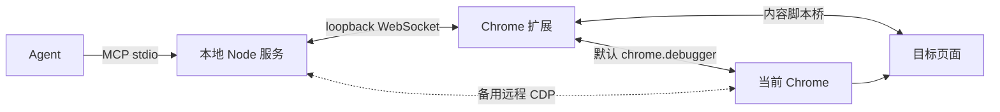

# AntiDebug Breaker MCP

本地 MCP 服务把 AntiDebug Breaker 的脚本开关、Hook 参数和 Vue/React 路由提供给 Agent，并默认通过已配对扩展的 `chrome.debugger` 通道控制正在运行的 Chrome 标签页，完成页面操作、源码查看、网络分析和断点调试。

此目录对应扩展 **3.1.0**。旧的 **3.0.8** 扩展没有 MCP bridge，不能直接连接；请使用对应版本的扩展与配套包。扩展 MCP 页的 **“下载 MCP + Skills”** 按钮在新标签页打开 [当前扩展版本的 GitHub Release](https://github.com/0xsdeo/AntiDebug_Breaker/releases/tag/v3.1.0)，从 **Assets** 下载 `AntiDebug_Breaker-Agent-3.1.0.zip`，解压后可按照包根目录的 `安装说明.md` 完成安装。商店用户继续使用商店扩展，不必另装源码版扩展。本仓库的打包命令只生成本地 ZIP，不上传 Chrome 商店、GitHub Releases 或 npm。

使用“加载已解压的扩展程序”时，覆盖本地目录后，请在 `chrome://extensions` 中找到 AntiDebug Breaker 并点击“重新加载”，再刷新目标网站。仅覆盖文件或重启浏览器，可能仍运行 Chrome 缓存的旧后台：角标与脚本注入正常，但新版弹窗读不到开关和路由。弹窗会在状态查询超时后显示后台读取错误，不会把未读取的状态渲染成所有脚本关闭。不要通过卸载扩展或清空存储解决这个问题。

升级扩展后，已打开的网页需要手动刷新才能加载新的内容脚本；弹窗不显示常规的“配置待刷新”提示或提供网页刷新按钮。原有脚本选择与 Hook 配置会保留；旧版超限关键词可以继续使用或删除，新添加的关键词仍受长度和数量限制。无效配置会通过 `state.get` 的 `configErrors` 及弹窗显示，切换其他脚本不会覆盖它。MCP 本地服务不在商店扩展 ZIP 中，更新扩展不会自动更新已运行的 Node 服务。

本版本在 manifest 中新增必需的 `debugger` 权限。Chrome 明确禁止把它声明为 `optional_permissions`，因此授权由扩展安装/更新流程处理，不能通过 `permissions.request()` 运行时申请或 `permissions.remove()` 单独撤销。旧版商店扩展更新后，Chrome 可能先将扩展停用，需你在扩展管理页确认新增权限并重新启用。[Chrome 权限说明](https://developer.chrome.com/docs/extensions/reference/api/permissions)

MCP 连接和浏览器控制初始均停用。在 MCP 面板填写地址和配对密钥后，点击 **“启用 MCP 并允许 Agent 控制浏览器”**，一次保存配对信息并开启这两项功能。启用后通过同一主按钮“保存连接设置”更新地址和密钥。浏览器控制仍以你的明确启用为前提，Agent 不能自行开启。普通脚本开关、Hook 参数与路由读取无需开启浏览器控制。

## 本地架构与实现位置

Agent 通过 stdio 连接一个 Node 服务。默认情况下，脚本、配置、路由和 CDP 命令都通过同一条已配对的本机 WebSocket 发给扩展。扩展通过 `chrome.debugger` 以 Chrome 提供的 `tabId` 附加目标，并用独立会话标识关联命令和事件。无需远程调试端口，也无需 Chrome 的远程会话连接确认弹窗。控制期间 Chrome 仍会显示调试提示条，用户可以停止当前控制。

底层扩展 API 及其可用 CDP 域见 [Chrome debugger API](https://developer.chrome.com/docs/extensions/reference/api/debugger)。原有远程 CDP 通道保留为备用连接方式，直接连接同一 Chrome/profile，并继续用页面 nonce 校验目标。



| 文件 | 职责 |
| --- | --- |
| `background.js` | 扩展消息入口、调用来源校验、生命周期事件和兼容消息。 |
| `extension/policy.js` | 父子脚本、组合脚本、Hook 参数及反 Hook 元数据规则。 |
| `extension/service.js` | 串行配置写入、revision、动态注册、文档身份、路由缓存和导航准备。 |
| `extension/bridge.js` | 本机 WebSocket 配对、重连、连接状态和有界 CDP 响应分片。 |
| `extension/debugger.js` | 调试权限及用户启用状态检查、新建空白标签页、按 tabId 管理 debugger 会话、命令白名单与断开清理。 |
| `popup/popup.html`、`popup/popup.js`、`popup/mcp.js`、`popup/mcp.css` | 四个顶部标签及内置 MCP 连接面板。 |
| `content.js`、`scripts/adb_runtime.js` | 隔离世界与页面的配置/路由桥、安装确认及 Hook 观察运行时。 |
| `mcp/src/index.js`、`mcp/src/config.js` | CLI、setup、配置读取与 stdio 生命周期。 |
| `mcp/src/tools.js` | 19 个 MCP 工具的输入校验、结果格式和配置刷新流程。 |
| `mcp/src/bridge.js` | 接受配对扩展连接、关联请求/响应和转发事件。 |
| `mcp/src/browser.js` | 选择扩展/远程通道，共享页面、网络、调试及早期注入实现；远程通道保留 nonce 目标匹配。 |
| `mcp/src/extension-browser.js` | 将扩展 debugger 会话与事件接入共享浏览器控制器。 |
| `tools/package.mjs`、`tools/package-agent.mjs` | 按显式允许清单生成扩展 ZIP 与 MCP + Skills 配套 ZIP；仅完整源码中包含打包器。 |

## 安装

### 1. 准备本地环境和扩展

- Node.js **22 或以上**，以及随 Node 安装的 npm。
- Chrome **120+**。默认扩展通道不要求开启远程调试；备用的当前会话远程连接流程要求 **Chrome 144+**。
- 使用对应版本的商店扩展；源码安装用户也可在 `chrome://extensions/` 开启开发者模式，点击“加载已解压的扩展程序”，选择包含 `manifest.json` 的项目根目录。避免同时启用两个版本。

从扩展 MCP 页打开对应的 GitHub Release，在 **Assets** 下载并解压配套包。它包含此 `mcp` 目录、`skills/antidebug-breaker-skills`、中文安装说明和 `bundle-manifest.json` 版本及文件校验清单；不含 Chrome 扩展、Node.js、已安装依赖或个人配对配置。下面的安装步骤同样适用于从完整源码获取的 `mcp` 目录。

加载本版本时确认扩展的调试权限；更新后若扩展被 Chrome 停用，请确认新增权限并重新启用。安装权限后，再通过弹窗中的“启用 MCP 并允许 Agent 控制浏览器”开启连接与控制。

### 2. 安装依赖并生成配对信息

在解压后或源码中的 `mcp` 目录执行（首次安装依赖需要联网）：

```powershell
node --version
npm ci
npm run setup
```

`setup` 会创建或读取当前用户目录下的 `.antidebug-breaker/mcp.json`，打印配置文件的绝对路径、本地连接地址和配对密钥。默认地址是：

```text
ws://127.0.0.1:19876/extension
```

已有配置不会被覆盖，重复执行 `npm run setup` 可以重新查看相同的配对信息。需要指定配置文件时，使用：

```powershell
npm run setup -- --config "C:\Users\YOUR_NAME\.antidebug-breaker\mcp.json"
```

配对文件只供本机使用，不要放进扩展 ZIP、提交到代码仓库或发送给他人。扩展 ZIP 不包含 `mcp/` 服务目录、`node_modules/` 或配对文件。

### 3. 在 MCP 客户端配置 stdio 服务

将下面示例的入口替换成你的实际绝对路径。客户端通过 stdio 启动服务，默认读取上一步生成的个人配置；`command` 为 Node 命令，客户端找不到 `node` 时可改为 Node 可执行文件的绝对路径。

```json
{
  "mcpServers": {
    "antidebug-breaker": {
      "command": "node",
      "args": [
        "C:/Tools/AntiDebug_Breaker-Agent-3.1.0/mcp/src/index.js"
      ]
    }
  }
}
```

不同客户端的外层配置格式可能不同，保持相同的启动命令即可。Windows JSON 路径可用 `/` 避免反斜杠转义。如果 setup 时指定了自定义配置，客户端 `args` 也需追加 `"--config"` 和同一配置文件的绝对路径。正常运行时 stdout 专供 MCP 协议使用，诊断信息写入 stderr。

`npm start` 可以用于检查服务是否能启动，但它不会代替 MCP 客户端。同一配对端口只运行一个服务进程；手动检查结束后退出该进程，再由客户端启动。

### 4. 一次启用 MCP 与浏览器控制

点击浏览器工具栏中的插件图标，打开扩展弹窗。顶部标签栏可横向滑动，在 AntiDebug、Hook、Vue/React 之后选择第 4 个 **MCP** 标签，进入内置连接面板：

1. 在“本地连接地址”填入 setup 显示的 `ws://127.0.0.1:19876/extension`。
2. 在“配对密钥”粘贴 setup 显示的完整密钥。
3. 点击“启用 MCP 并允许 Agent 控制浏览器”，等待显示“已连接到本地 MCP”。

这次点击同时保存配对信息、启用 MCP 连接并允许浏览器控制。启用状态与配对信息保存在扩展本地存储中，密钥不会写入网页。服务未启动时，已启用的扩展会等待并重连。

| 面板操作 | 结果 |
| --- | --- |
| 启用 MCP 并允许 Agent 控制浏览器 | MCP 连接停用时显示，保存地址、密钥，同时启用 MCP 连接与浏览器控制。 |
| 保存连接设置 | 两项均已启用时显示的主按钮文字，用于更新配对信息。 |
| 重新启用浏览器控制 | MCP 连接已启用、浏览器控制停用时显示，保存当前地址和密钥，并明确启用浏览器控制。 |
| 停止 MCP | 任一功能启用时显示的次按钮，同时停用 MCP 连接与浏览器控制，释放扩展调试会话；保留已保存的地址和密钥，供以后再次启用。 |

正常重启 Chrome 或扩展后台后，已保存的启用状态会保留；明确停止的状态也会保留。旧版已经配对但尚未允许浏览器控制的用户升级后保持原状态，不会自动获得控制授权。连接已启用时，需明确点击“重新启用浏览器控制”；重新打开面板不会授权。

此时已经可以读取配置、保存下次导航生效的设置，并使用路由工具。`apply: reload` 和浏览器调试工具还需要下一步的 Chrome 连接。无需另装 Chrome DevTools MCP。

### 5. 通过扩展连接当前 Chrome（默认）

完成上一步的合并启用后，让 Agent 调用 `adb_connect_browser`：

```json
{}
```

也可以显式传入 `{"transport":"extension"}`。服务复用当前扩展连接，不会打开 `chrome://inspect/#remote-debugging`，不会弹出远程会话连接请求，也不会新建或关闭用户浏览器。Chrome 自己的调试提示条仍然保留。

`adb_list_pages` 返回的是扩展 `tabId`。首次对某个 tab 使用 `adb_debug`、`adb_snapshot` 等浏览器工具时，扩展直接按 tabId 附加目标，不通过 URL 猜测目标，也无需页面执行 nonce 校验。目标处于暂停状态时可附加并读取调试信息；需要执行页面 JavaScript 的操作仍可能要求先 resume。连接成功后使用的工具与远程通道一致。

如需停止连接与后续控制，在弹窗点击“停止 MCP”。通过 Chrome 调试提示条点击取消则只停用浏览器控制并释放全部扩展调试会话，MCP 连接保持原启用状态。Agent 的下一次调用不能自行重新附加；需你再次点击“重新启用浏览器控制”。正常重启不会恢复被取消的控制。

### 备用：连接 Chrome 的远程调试会话

需要远程 CDP 时，先启动与扩展相同的 Chrome/profile。在 Chrome 144+ 打开 `chrome://inspect/#remote-debugging` 并开启调试连接，再调用 `adb_connect_browser`：

```json
{"transport":"remote","channel":"chrome"}
```

Chrome 弹出连接请求时，需在浏览器中允许该连接。此确认只属于远程通道；MCP 不会替你开启远程调试或确认弹窗。[Chrome 官方说明](https://developer.chrome.com/blog/chrome-devtools-mcp-debug-your-browser-session)

远程通道在首次绑定 tab 时写入临时 nonce，再通过 CDP 核对目标身份。此时页面 JavaScript 必须可运行；若已经暂停，先继续执行，再完成首次绑定。绑定完成后可暂停、检查调用帧和单步。

已有专用调试端口时，`adb_connect_browser` 也支持本机 `browserURL`、`browserWSEndpoint`，或指向含 `DevToolsActivePort` 文件的 `userDataDir`；三者最多选一个。`channel` 支持 `chrome`、`chrome-beta`、`chrome-dev`、`chrome-canary`，以及对应的 `stable`、`beta`、`dev`、`canary` 别名。

兼容旧调用：省略 `transport` 但提供 `channel` 或上述任一端点参数时，自动选择 `remote`；因此 `{"channel":"chrome"}` 仍走远程通道。只有不带这些远程参数的 `{}` 默认走扩展。`transport: extension` 不能与 channel/远程端点混用。远程通道的授权与扩展内浏览器控制启用状态独立，结束时使用 `adb_disconnect_browser` 或 Chrome 的远程调试设置断开。

## 安装与更新 Skills

将配套包中的整个 `skills/antidebug-breaker-skills` 目录，按所用客户端的技能安装方式放到其支持的技能位置，保留 `SKILL.md`、`references` 与 `agents`。不要只复制主文件。重新载入后，通过客户端技能列表或加载记录确认 `Antidebug_Breaker_skills` 已加载；MCP 连接则可通过 `adb_capabilities` 与 `adb_list_pages` 验证。扩展 MCP 页的“提示词”按钮提供三类任务的推荐提示词。

升级时选择与扩展对应的配套包，停止旧 MCP 服务，更新文件并在 `mcp` 目录执行 `npm ci`，然后重启客户端中的服务。路径改变时更新客户端入口，同时更新已安装的完整技能目录。默认配对配置保存在用户目录，更新配套包不会重置它；如使用自定义配置，继续指向原文件。商店更新扩展不会自动更新本地 MCP 或 Skills。

## 完整工具表

当前注册 **19 个 MCP 工具**。表中的 `tabId` 来自 `adb_list_pages` 或 `adb_navigate action: "new"` 返回的新标签页 ID，不要把 CDP target ID、列表下标或页面 URL 当成 tabId。

| 工具 | 用途与主要参数 |
| --- | --- |
| `adb_capabilities` | 无参数。读取扩展配对、浏览器连接状态和能力；尚未配对时也可调用。 |
| `adb_list_pages` | 无参数。列出扩展标签页和已经验证的浏览器绑定。 |
| `adb_list_scripts` | 无参数。读取脚本 ID、分类、父子关系和可配置的 Hook 参数 schema。 |
| `adb_get_state` | `tabId`。读取有效模式、启用脚本、配置、revision 和当前页面应用状态。 |
| `adb_set_scripts` | `tabId`、`scope: hostname/global`、`changes: [{id,enabled}]`；可选 `apply`、`expectedRevision`。批量设置脚本，不使用 toggle；reload 要求已连接浏览器。 |
| `adb_set_hook_config` | `scriptId`、`patch`；可选 `tabId`、`apply`。patch 支持该脚本实际具备的 `value`、`param`、`keyword_filter_enabled`、`debugger`、`stack`；reload 要求 tabId 和浏览器连接。 |
| `adb_get_routes` | `tabId`；可选 `framework: vue/react/all`、`rescan`、`timeoutMs`。读取或重新扫描路由，检查返回的状态和文档身份。 |
| `adb_set_mode` | `mode: standard/global`。切换按域名或全局脚本选择模式。 |
| `adb_connect_browser` | `{}` 默认走已配对扩展；可选 `transport: extension/remote`。提供 `channel` 或 `browserURL` / `browserWSEndpoint` / `userDataDir` 且未指定 transport 时选择 remote。 |
| `adb_disconnect_browser` | 无参数。断开本 MCP 的浏览器调试连接，保留 Chrome 和标签页。 |
| `adb_navigate` | `action: new/navigate/reload/back/forward`；new 给 `url`、不传 `tabId`，可选 `active`（默认 true），需要扩展通道。其他操作必须给 `tabId`，navigate 还需 `url`。可选 `timeoutMs`。 |
| `adb_snapshot` | `tabId`；可选 `maxElements`、`maxTextLength`。读取有界页面快照和元素 ref。 |
| `adb_interact` | `tabId`、`action: click/type/press/scroll`；click/type 使用 ref，type 给 text，press 给 key；支持滚动参数、`replace` 和文档身份校验。 |
| `adb_screenshot` | `tabId`；可选 `format: png/jpeg/webp`、`quality`、`fullPage`。直接返回 MCP 图片。 |
| `adb_debug` | `tabId`、`action: attach/status/pause/resume/stepInto/stepOver/stepOut/setBreakpoint/removeBreakpoint/listBreakpoints/variables`。断点可用 url、urlRegex 或 scriptId，位置从 1 开始。 |
| `adb_source` | `tabId`、`action: list/get/search`。get/search 使用 scriptId；支持行范围、query、正则、大小写和分页。 |
| `adb_network` | `tabId`、`action: list/get`。get 使用 requestId，可选 `includeBody`；list 支持 URL 子串过滤和分页。 |
| `adb_get_events` | 可选 `tabId`、`cursor`、`limit`。读取有界 Hook、console、network 和 debugger 事件缓存，暂停时也可读取。 |
| `adb_evaluate` | `tabId`、`expression`；可选 `callFrameId`、`returnByValue`、`awaitPromise`、`timeoutMs`。可在当前页面或暂停调用帧中计算表达式。 |

`scripts.prepare` 和 `pages.create` 是导航准备、新建标签页使用的内部 bridge 方法，不额外注册为用户工具。

## 使用工作流

### 新建标签页并访问网站

先启用 MCP 和浏览器控制，再调用 `adb_connect_browser`（参数 `{}`）。即使当前只有 Chrome 新标签页或插件页，也可直接调用 `adb_navigate`：

```json
{
  "action": "new",
  "url": "https://example.com/",
  "active": false
}
```

省略 `active` 时会选中新标签页；`false` 表示在后台打开。返回的 `created: true` 和 `tabId` 表示已经创建，后续快照、网络和调试工具使用这个 `tabId`。创建时先打开空白页、接入观察通道和目标主机的早期 Hook，再导航到目标，保留首屏请求采集能力。原有页面会保留。

`timeoutMs` 控制导航等待时间；创建和调试初始化另有各自超时。`paused` 或 `timeout` 不代表创建失败；继续使用返回的 `tabId` 检查状态或恢复执行。若导航失败，错误 `details` 仍会包含已创建的 `tabId`，不要自动重复 `action: "new"`。创建回调超时等无法确认的情况会标为 `created: "unknown"`，先检查 `adb_list_pages` 与可能晚到的 `page.created` 事件。

新建操作需要默认扩展通道；备用 remote 通道仍可操作已有标签页。停止浏览器控制后不能创建新页，断开 MCP 不会关闭已创建的标签页。旧扩展若不支持该操作，需要更新并重新加载扩展；MCP 客户端也需重启服务以读取新的工具参数。

### 配置 Hook，再复现网页行为

先调用 `adb_capabilities`、`adb_list_pages`、`adb_list_scripts`，确认扩展和目标 tab。需要源码、事件、网络或断点时，连接浏览器后先调用 `adb_debug`，参数为 `{"tabId":23,"action":"attach"}`，完成目标绑定和观察通道初始化。

例如，为 tab 23 对应域名开启 XMLHttpRequest.open Hook：

```json
{
  "tabId": 23,
  "scope": "hostname",
  "changes": [{"id": "hook_xhr_open", "enabled": true}],
  "apply": "next_navigation"
}
```

使用 `adb_set_scripts` 提交上述参数，然后用 `adb_set_hook_config` 设置捕获条件：

```json
{
  "tabId": 23,
  "scriptId": "hook_xhr_open",
  "patch": {
    "keyword_filter_enabled": true,
    "param": ["/api/"],
    "debugger": 0,
    "stack": 1
  },
  "apply": "next_navigation"
}
```

再通过 `adb_navigate` 调用 `{"tabId":23,"action":"reload"}`，复现请求，用 `adb_get_events` 和 `adb_network` 查看结果。普通参数设置不会自动打开该脚本；如果当前模式是 global，hostname 配置只会作为非当前模式的预设保存。先通过 `adb_get_state` 确认作用域与模式。

关键字开关为 false 时捕获所有匹配调用，并保留已有关键字。开关为 true 且数组非空时启用子串过滤；true 加空数组仍不过滤。`debugger`、`stack` 使用 0/1；内部 flag 由服务计算，不需要客户端手工设置。

### 获取 Vue / React 路由

先开启 `Get_Vue_0` 或 `Get_React_0` 并刷新，再调用：

```json
{"tabId":23,"framework":"all","rescan":true,"timeoutMs":5000}
```

对应工具为 `adb_get_routes`。脚本未启用会返回 `script_disabled`；等待超时、未发现路由和序列化失败有各自状态。只会获取当前已加载、能够被采集脚本识别的路由，不等于枚举服务端全部接口。

`Get_Vue_1` 包含额外的跳转修改行为，不会因为读取路由而自动启用。它与 `Get_Vue_0` 的父子替换由共享策略处理。多个实例分别返回数据；同域不同 tab 的缓存按文档隔离。

### 在断点暂停后分析

1. 完成目标绑定后，将对应 Hook 的 `debugger` 设为 1，刷新并复现调用；也可用 `adb_debug` 设置源码断点。
2. 导航或页面操作返回 `paused` 时，先用 `adb_debug` 的 status 读取调用帧。暂停不是页面加载完成。
3. 使用 variables 查看作用域，用 `adb_source` 读源码，或让 `adb_evaluate` 携带当前 `callFrameId` 读取局部变量。
4. 使用 stepInto / stepOver / stepOut 单步，或 resume 继续。每次新的暂停都应重新读取调用帧。

默认扩展通道不保证与 DevTools 同时控制同一目标；Chrome 可能拒绝附加或断开已有扩展调试会话，此时关闭冲突的调试器并检查连接状态。备用远程通道可以与 DevTools 共享目标状态，DevTools 的继续执行或断点操作会改变 MCP 看到的状态。以 `adb_capabilities`、返回事件和最新 status 为准。

### 页面操作和结束连接

`adb_snapshot` 返回元素 ref，再用 `adb_interact` 点击或输入。重新获取快照或导航后不要复用旧 ref。需要图像时调用 `adb_screenshot`。

结束当前调试会话时调用 `adb_disconnect_browser`，保留 Chrome 和标签页。要同时停用 MCP 连接与扩展通道的后续控制，在弹窗 MCP 标签点击“停止 MCP”；地址与密钥会保留，恢复时再次点击明确的启用按钮即可。需要退出本地 Node 服务时，再停止 MCP 客户端中的该服务。停止操作不会撤销 Chrome 的必需调试权限；如果另外选择了远程 CDP 通道，使用 `adb_disconnect_browser` 或 Chrome 的远程调试设置结束它。

## 作用域与当前限制

- **脚本选择**：standard 模式按 hostname 保存，不区分协议或端口；global 模式使用全局脚本列表。修改非当前模式的选择不会隐式切换模式。
- **Hook 参数**：目前按 scriptId 全局共享，不是 tab 或域名专属参数。`apply: reload` 要求已连接 Chrome，先验证目标、保存配置，再通过 CDP 刷新指定 tab；不代表所有受影响页面都已应用新参数。
- **应用时机**：默认 `apply: next_navigation`。响应会区分保存、注册以及已观察到的安装；保存成功不能证明旧文档里的 Hook 已卸载或重新安装。reload 返回的 `current` 是选中 tab 的最新状态，`applied: true` 表示该页确认应用了本次保存的 revision；`applicationStatus: superseded` 表示检查期间配置版本已经变化，应以 current 为准。`pending_resume` 需要继续执行，`unconfirmed` 需要再查当前状态。
- **首屏时序**：MCP 发起的 HTTP(S) navigate/reload 会先读取目标域名快照，将配置与包内脚本作为早期脚本安装，再开始导航，已覆盖首屏内联脚本的同步 Hook。检查返回的 `earlyHooks`；当前覆盖限定目标 hostname，不覆盖跨域重定向、back/forward 历史导航或普通浏览器手动刷新。普通导航仍依赖扩展 document_start 注册与异步配置同步。
- **目标范围**：扩展控制以顶层文档为主；浏览器适配层支持顶层页面与同进程执行上下文，**没有自动覆盖 OOPIF 和 workers**。Chrome 内部页面及不可访问目标会明确报错，不按 URL 猜测目标。
- **首次绑定与暂停**：默认扩展通道按 tabId 附加，不要求页面先执行代码；备用远程通道的首次 nonce 绑定需要页面可运行。完成绑定后，读取暂停状态、作用域、源码和服务端事件缓存可以继续工作；需要执行页面 JavaScript 的操作可能要求先 resume。
- **数据保留**：事件、网络记录和源码索引使用有界缓存；网络与 console 观察从目标 attach 后开始，不恢复 attach 前的完整历史。请求体/响应体和长文本可能截断或不可用，检查返回状态与截断标记。
- **扩展传输大小**：普通 bridge 帧默认最多 1 MiB。CDP 响应可分片，单个完整 JSON 响应上限为 16 MiB，包含源码、截图与网络响应体。此限制作用在公开工具截断之前：`adb_network` 最终最多返回 1,000,000 个字符，并以 `bodyTruncated` 标记截断；原始 CDP 响应若超过传输上限，仍会得到 `bodyError`，不能靠最终文本截断绕过。超大的其他响应返回 `MESSAGE_TOO_LARGE`；不会把半段 JSON 当作成功结果。
- **连接生命期**：浏览器或扩展重新连接后，重新列出页面并绑定目标；导航后重新获取文档、元素 ref 与调用帧。`adb_get_routes` 建议使用 100–30000ms 的超时。
- **暂停与超时**：返回 `operationPending: true` 表示已提交的操作尚未结束，超时不会撤销浏览器中的操作。先通过 `adb_debug` status 或事件确认状态；暂停时可以读取调用帧并 resume/step。收到 `operation.settled` 或状态确认不再 pending 后，再发起新的导航或输入，避免重复操作。
- **已有浏览器**：服务只连接当前浏览器，不创建或关闭用户浏览器。默认通道需要扩展已配对且用户启用浏览器控制；备用远程通道另需 Chrome 的远程调试授权。

## 常见问题

| 现象 | 处理 |
| --- | --- |
| 扩展一直显示等待连接 | 确认 MCP 客户端已启动服务、URL 使用 setup 打印的 `127.0.0.1` 地址、两端使用相同配置文件和密钥。 |
| `PORT_IN_USE` | 退出使用同一端口的手动 `npm start` 或重复 MCP 进程；如果更换配置中的 port，同步更新扩展地址。 |
| `EXTENSION_NOT_CONNECTED` / `EXTENSION_DISCONNECTED` | 确认加载了含 bridge 的 3.1.0 扩展，并开启扩展 MCP 设置。 |
| `DEBUGGER_CONTROL_DISABLED` | 在扩展 MCP 面板点击“重新启用浏览器控制”；若 MCP 已停止，点击“启用 MCP 并允许 Agent 控制浏览器”。Agent 不会自行开启控制。 |
| `DEBUGGER_PERMISSION_REQUIRED` / `DEBUGGER_UNAVAILABLE` | 更新并重新加载包含 debugger 模块的扩展；如 Chrome 要求确认新增权限并重新启用扩展，先完成该步骤。 |
| `DEBUGGER_DETACHED` / `STALE_DEBUGGER_SESSION` | Chrome、用户或连接变化已结束会话；检查浏览器控制状态、目标及其他调试器。若通过 Chrome 取消了调试，先在面板明确重新启用，再连接/附加。 |
| `TARGET_MISMATCH` | 备用 remote 通道中，确认 CDP 与扩展属于同一 Chrome/profile，目标是普通网页，首次 nonce 绑定时页面没有暂停。 |
| `TARGET_PAUSED` | 先读取 `adb_debug` status；使用当前调用帧分析，或 resume 后再做页面操作。 |
| `TARGET_BUSY` / `operationPending: true` | 之前的导航、输入或表达式仍在执行；检查 debug status 和事件，暂停则先分析或继续，等待操作结束。 |
| `REVISION_CONFLICT` | 重新读取 `adb_get_state`，基于新的 revision 提交开关修改。 |
| 路由超时 / `content_unavailable` | 先开启相应采集脚本并刷新页面，等待应用加载，再进行 rescan。 |
| Hook 参数保存了但当前页没变化 | 检查模式、脚本是否开启、应用状态和是否完成刷新；参数本身不会自动开启脚本。 |

## 开发验证与发布打包

本节命令在**完整源码仓库**中运行；面向最终用户的配套包不包含测试、扩展源码或打包器。

服务测试在 `mcp` 目录运行：

```powershell
npm test
```

扩展控制层测试在项目根目录运行：

```powershell
node --test tests/*.test.cjs
```

真实浏览器集成测试需要一个可加载未打包扩展的 **Chrome for Testing** 可执行文件。先进入 `mcp` 目录，用 PowerShell 设置路径后运行：

```powershell
$env:ADB_TEST_CHROME = 'C:\Tools\chrome-for-testing\chrome-win64\chrome.exe'
node --test test/integration.test.js test/extension-browser.integration.test.js
```

未设置 `ADB_TEST_CHROME` 时，`npm test` 中的真实浏览器用例会跳过。测试会启动独立测试浏览器、创建临时 profile，并使用本地 HTTP fixture；结束后关闭测试浏览器并清理临时 profile。请选择支持测试所用未打包扩展加载方式的 Chrome for Testing 版本。

真实的 3.0.8 覆盖升级回归还需要原版扩展文件。将商店版 3.0.8 ZIP 解压到单独目录，再设置 `ADB_TEST_LEGACY_EXTENSION` 为包含旧版 `manifest.json` 的目录，并在 `mcp` 目录运行：

```powershell
$env:ADB_TEST_LEGACY_EXTENSION = 'C:\Fixtures\AntiDebug_Breaker-3.0.8'
node --test test/extension-upgrade.integration.test.js test/upgrade.test.js
```

此用例在临时目录复制旧版和新版，以相同扩展路径及测试 profile 验证覆盖文件、浏览器重启、旧后台错误提示和正式重新加载后的配置及路由恢复，不修改提供的旧版目录。未提供旧版目录时，该用例跳过。

已验证的 fixture 场景包括扩展→WebSocket→CDP 链路、Popup 共享控制、同域与重复 URL 标签隔离、模拟 Vue/React 路由对象、首屏内联 Hook、暂停/继续/单步、MCP SDK 参数设置及 reload。Hook 观察测试另验证配置应用、重复安装保护和事件数据。这些是本地测试覆盖，不代表对任意真实站点、所有框架版本或所有反调试组合的兼容性保证。

在项目根目录生成扩展与配套 ZIP：

```powershell
node tools/package.mjs --list
node tools/package.mjs
```

输出两个独立文件：

- `dist/AntiDebug_Breaker-<manifest.version>.zip`：Chrome 扩展，ZIP 根目录直接包含 manifest；当前为 `AntiDebug_Breaker-3.1.0.zip`。
- `dist/AntiDebug_Breaker-Agent-<manifest.version>.zip`：MCP + Skills 配套包；当前为 `AntiDebug_Breaker-Agent-3.1.0.zip`，解压后有同名顶层目录。

`--list` 验证并显示文件清单，不生成 ZIP。只构建配套包时运行 `node tools/package-agent.mjs`。扩展打包器校验 manifest、页面资源和脚本依赖；配套包收录 MCP 运行源码、package.json、package-lock.json、MCP README、完整技能目录、中文安装说明和生成的 `bundle-manifest.json`。只收录明确允许的分发文件，排除 `node_modules`、测试缓存及个人配对配置；新增资源时应同步维护清单和依赖验证。

配套包使用扩展版本命名，版本清单同时记录 MCP 组件版本和文件校验信息。Chrome 扩展 ZIP 不包含 MCP 服务，也不会将依赖装入用户电脑；用户仍需完成 `npm ci` 和客户端 stdio 配置。

发布当前版本时：

1. 在完整源码上完成相应验证，运行 `node tools/package.mjs`，检查两个 ZIP 的内容和版本。
2. 在 [0xsdeo/AntiDebug_Breaker 的 GitHub Releases](https://github.com/0xsdeo/AntiDebug_Breaker/releases) 发布 tag 为 **`v3.1.0`** 的 Release，上传 **`AntiDebug_Breaker-Agent-3.1.0.zip`** 附件，保持文件名不变。
3. 验证对应附件能够下载并按包内说明安装，再将 `AntiDebug_Breaker-3.1.0.zip` 通过原 Chrome 商店条目提交更新。

下载按钮在新标签页打开该扩展版本的 Release 页面，地址格式为 `https://github.com/0xsdeo/AntiDebug_Breaker/releases/tag/v<扩展版本>`，由用户在 **Assets** 选择配套包，不会自动转向最新 Release。发布元数据集中保存在项目根目录的 `agent-release.json`：升级时同步修改 `extensionVersion`、`tag`、`assetName`；MCP 自身版本变化时同步修改 `mcpVersion`，并更新安装说明中的版本示例。打包器会检查元数据与扩展 manifest、MCP package/lock 是否一致；不要用不同文件名替代约定附件。**打包命令不会发布或上传任何内容；Release 尚未发布时页面不可用，附件尚未上传时 Assets 中不会出现配套包。**
